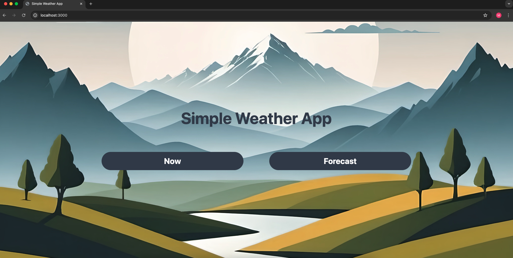
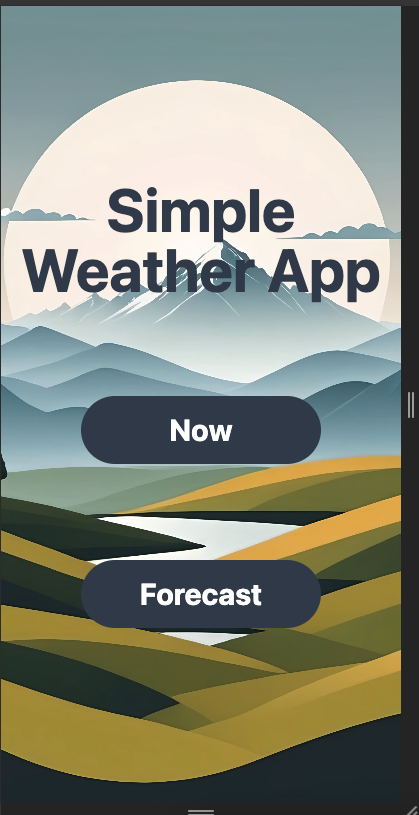
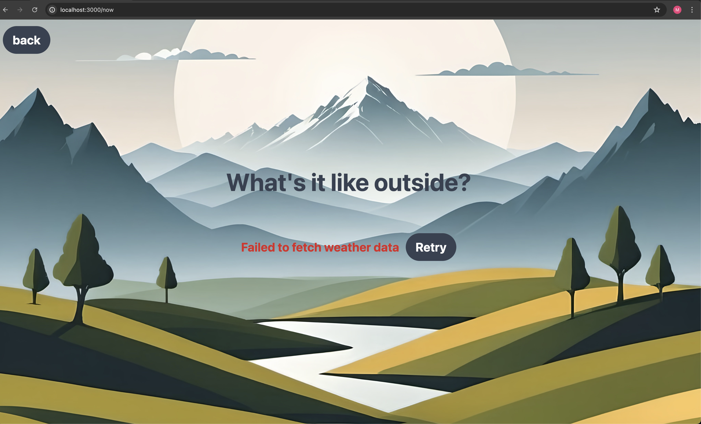
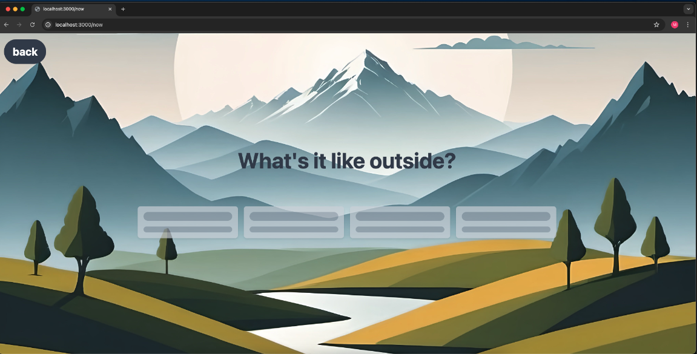
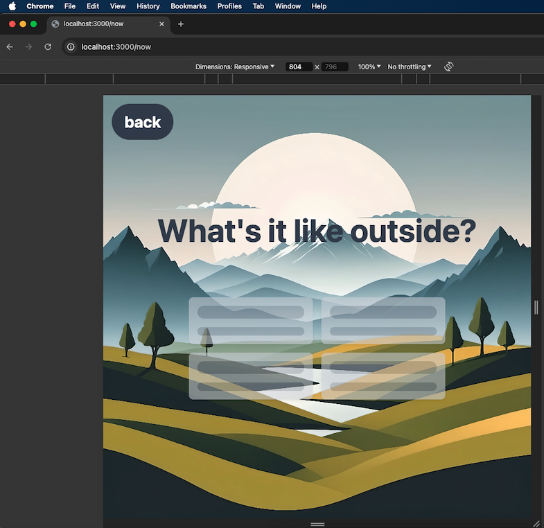
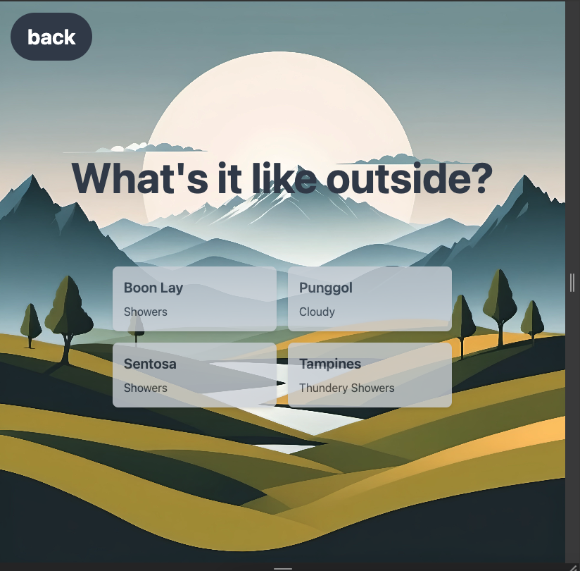
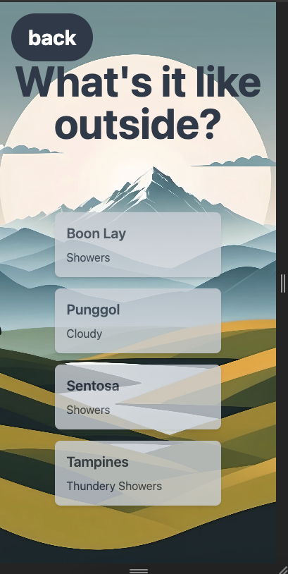
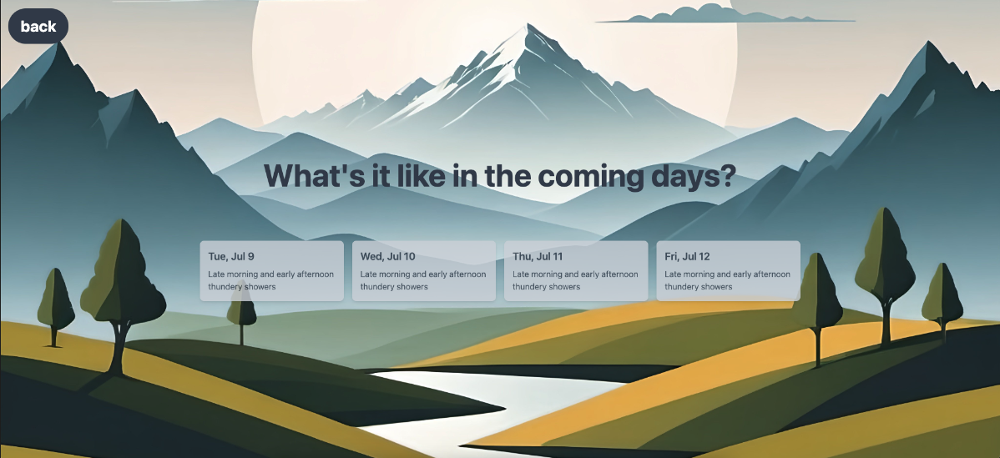

# Simple Weather App

A simple weather app using NextJS.

## Assignment: Weather Application Enhancements

### Task 1: Fix the intermittent failure to load weather information in now page

**Problem**: The backend API https://birdsofaweather.netlify.app/api/weather/now keeps failing intermittently. However,
the response from the corresponding NextJS API route translates the error to a 200 OK response.

**Fix and Refactor**:

1. **API Route Update:** API route has been updated to return 500 error when the backend API fails
2. **useWeatherNowData Hook:** A custom hook named `useWeatherNowData` was implemented to manage fetching weather data and
   leverage React Query. React Query facilitates retrying failed requests with backoff and caching weather data.
   This caching is beneficial as weather information typically updates infrequently.
3. **Loading Indicator:** A CardsSkeleton component now displays a loading indicator while fetching data.
   This provides visual feedback to the user.
4. **Error Handling:** If the backend API fails after multiple retries (default 3 with React Query),
   an `ErrorMessageWithRetry` component displays an error message along with a "Retry" button for user interaction.
5. **Weather Card Logic:** The logic to display Weather Cards has now been moved to a dedicated `WeatherCards` component.

### Task 2: Implement the Forecast page

**Implementation**

1. The below new components are introduced to implement the Forecast page

   `api/forecast.ts` - API route for Forecast information

   `useWeatherForecastData.ts` - Custom hook to get weather forecast data using React Query

   `forecast.tsx` - New page to display weather forecast for the next 4 days

   `components/weather/ForecastCards` - Display Weather Forecast card with date and forecast weather info

### Task 3: Additional tasks

#### Tools and Configuration:

1. **Linting and Formatting:** Eslint and Prettier plugins have been integrated for code linting and formatting.
2. **Pre-commit Hook:** Husky and lint-staged are used to enforce linting and formatting before each commit.
3. **Setup Documentation:** Instructions for configuring these tools are documented in [SETUP.md](./SETUP.md)
4. **Unit Testing:** Unit Tests are implemented using React Testing Library and Jest.
5. **Mocking with MSW:** Mocking of APIs has been implemented using Mock Service Worker (MSW).
   All the API mocks data can be found in the `mocks` folder.
   The reasoning behind using MSW is that it intercepts the API requests at the network level. So, this does not require
   us to mock the fetch. So, using MSW, if we are to test the logic in a React Component, we don't really need to mock the
   custom hooks which fetch data from APIs. Instead, the tests look elegant, with as less mocks as possible, while still
   giving us the confidence similar to E2E tests for the components.
6. **Client side Data Management with React Query:** React Query simplifies data caching and retrying failed API
   requests within the client application.
7. **Environment variables:** Backend API URL has been configured in `.env.local` file. NextJS comes with a built-in
   support for environment variables using .env files.

#### Component Structure and Design:

1. `components/weather folder` - Dedicated folder for weather specific components has been added. The general components are
   available in the `components` directory. `Card` component has been refactored to allow displaying of any data with title
   and description. The `components/weather/weatherCards` and `components/weather/forecastCards` are built on top of `Card` component.
2. **Common Layout:** A common layout has been added in `_app.tsx` to avoid duplication of layout structure across all pages
3. **Custom Hooks for Separation of Concerns:** Custom hooks have been introduced to handle data fetching,
   keeping React components free from data fetching logic. This promotes clean separation of concerns.
4. **Responsive Design:** The application now adapts layouts for different screen sizes.
   Sample images for different devices are included for reference (not exhaustive):

##### Home Page




##### Now Page







##### Forecast Page



### Task 4: Complete the jobs in .github/workflows

1. The test job is complete.
2. Additional setup (like AWS credentials / ECR configuration / Dockerfile) is needed to configure the deploy job.
   Instructions have been followed from
   https://github.com/aws-actions/amazon-ecs-deploy-task-definition?tab=readme-ov-file and
   https://github.com/aws-actions/amazon-ecr-login?tab=readme-ov-file#aws-credentials

### Other areas for improvements:

1. Server Side Rendering could be considered for faster loading since the weather forecast data changes (infrequently?).
2. UI can be enhanced using icons to show weather details, or a popup to show further details
   on hover on cards.
3. Tools like commitlint can be added to ensure conventional commits
4. Tests for Home page can be added as well. Currently only Now and Forecast page has tests

## Setup

1. Fork this repository to your own account, clone it, then run the following commands:

- `npm install`
- `npm run dev`

2. Visit the localhost domain displayed in the console e.g. `http://localhost:3000` and you should see this:


---

3. Currently only the "Now" page has been implemented, it calls a backend function to fetch weather data from 4 areas in Singapore and displays it like so:


## Tasks

1. Something is wrong with the "Now" page and there have been user reports that the weather information does not appear. Investigate and rectify the problem.

2. Implement the "Forecast" page to display the next 4 days of weather information similar to the "Now" page. You can also improve it as you see fit.

Note: The forecast data can be found at <https://birdsofaweather.netlify.app/api/weather/forecast>

## Additional Info

Implement your tasks as you would in a real project and make traceable commits with meaningful and consistent commit messages.

You are encouraged to modify, add, and/or remove components as needed. Also feel free to make any changes you would in a large-scale production project e.g. adding tests, linters, and so on.

There is a challenge for devops specific tasks (optional) under the .github/workflows

## Docs

This section details the requests and responses for each API in use.

### /now

HTTP Method - GET

URL - <https://birdsofaweather.netlify.app/api/weather/now>

Response format - `{ items: WeatherData[] }`

Example response:

```
{
  "items": [
    {
      "area": "Boon Lay",
      "forecast": "Partly Cloudy (Day)"
    },
    {
      "area": "Punggol",
      "forecast": "Partly Cloudy (Day)"
    },
    {
      "area": "Sentosa",
      "forecast": "Partly Cloudy (Day)"
    },
    {
      "area": "Tampines",
      "forecast": "Partly Cloudy (Day)"
    }
  ]
}
```
